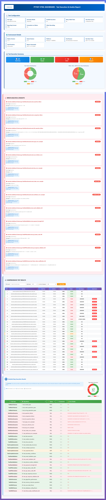

# pytest-html-dashboard

[](https://pypi.org/project/pytest-html-dashboard/)
[](https://pypi.org/project/pytest-html-dashboard/)
[](https://pypi.org/project/pytest-html-dashboard/)
[](https://opensource.org/licenses/MIT)
[](https://github.com/nireshs/pytest-html-dashboard/stargazers)

**Transform your pytest HTML reports into beautiful, interactive dashboards!**

A comprehensive pytest plugin that enhances HTML reports with interactive charts, intelligent error classification, and modern styling.

## ✨ Features

🎯 **Interactive Charts** - Visualize test results with Chart.js powered donut and pie charts
🎨 **Modern UI** - Beautiful gradient styling with responsive design
🔍 **Smart Error Analysis** - Automatic error classification with suggested fixes
📊 **Comprehensive Tables** - Detailed test information with expandable error details
🔧 **Highly Configurable** - YAML, CLI, or programmatic configuration
⚡ **Zero Config** - Works out of the box with sensible defaults
📱 **Mobile Responsive** - Looks great on all devices
🎭 **Custom Branding** - Add your logo, colors, and company name

## 📸 Sample Report

### 🖼️ Preview



> **[🔗 View Live Interactive Report](https://htmlpreview.github.io/?https://github.com/nireshs/pytest-html-dashboard/blob/main/reports/complete_dashboard_report.html)** ← Click to see charts, filters, and interactive features!

Or [download and open locally](reports/complete_dashboard_report.html)

### ✨ What's Included:
- **📊 Test Status Distribution** - Visual breakdown of passed/failed/skipped tests with interactive charts
- **📈 Pass Rate Charts** - Overall test success metrics with data labels
- **🔍 Error Analysis** - Categorized failures with remediation suggestions
- **📋 Comprehensive Test Table** - Filterable, sortable results with expandable error details
- **⚡ Step Execution Summary** - Detailed test step information with status tracking
- **🎨 Modern UI** - Beautiful purple gradient design with hover effects

## 🚀 Quick Start

### Installation

```bash
pip install pytest-html-dashboard
```

### Basic Usage

```bash
pytest --html=report.html --self-contained-html
```

That's it! The plugin automatically enhances your HTML report with all features enabled.

## 📖 Configuration

### YAML Configuration

Create `pytest_html_dashboard.yaml`:

```yaml
branding:
  company_name: "My Company"
  report_title: "Test Execution Dashboard"
  logo_url: "path/to/logo.png"  # Or base64 encoded
  primary_color: "#667eea"
  secondary_color: "#764ba2"

charts:
  enable_charts: true
  chart_height: 300
  chart_animation: true

report:
  enable_enhanced_reporting: true
  enable_error_classification: true
  show_timestamps: true
```

### Command Line Options

```bash
pytest --html=report.html \
       --dashboard-company-name="My Company" \
       --dashboard-report-title="Test Dashboard" \
       --dashboard-primary-color="#667eea"
```

### Programmatic Configuration

```python
# conftest.py
from pytest_html_dashboard import ReporterConfig, BrandingConfig

def pytest_configure(config):
    branding = BrandingConfig(
        company_name="My Company",
        report_title="Custom Dashboard",
        primary_color="#667eea"
    )

    reporter_config = ReporterConfig(branding=branding)
    config._dashboard_config = reporter_config
```

## 📊 Configuration Options

### Branding

| Option | Default | Description |
|--------|---------|-------------|
| `company_name` | "Test Automation Framework" | Your company/project name |
| `report_title` | "Test Execution Dashboard" | Report header title |
| `logo_url` | None | Logo image (URL or base64) |
| `primary_color` | "#004488" | Primary theme color |
| `secondary_color` | "#0066CC" | Secondary theme color |
| `success_color` | "#4CAF50" | Success indicator color |
| `failure_color` | "#f44336" | Failure indicator color |

### Charts

| Option | Default | Description |
|--------|---------|-------------|
| `enable_charts` | true | Enable/disable charts |
| `chart_height` | 300 | Chart height in pixels |
| `chart_animation` | true | Animated chart transitions |
| `show_pass_rate_chart` | true | Display pass rate visualization |
| `show_status_distribution_chart` | true | Display status breakdown |

### Report Features

| Option | Default | Description |
|--------|---------|-------------|
| `enable_enhanced_reporting` | true | Enable all enhanced features |
| `enable_error_classification` | true | Categorize and analyze errors |
| `enable_comprehensive_table` | true | Show detailed test table |
| `max_error_message_length` | 100 | Truncate long error messages |
| `show_timestamps` | true | Display test execution times |
| `show_duration` | true | Show test durations |

## 🎯 CI/CD Integration

### GitHub Actions

```yaml
- name: Run tests
  run: pytest --html=report.html --self-contained-html

- name: Upload report
  uses: actions/upload-artifact@v3
  with:
    name: test-report
    path: report.html
```

### Jenkins

```groovy
pipeline {
    stages {
        stage('Test') {
            steps {
                sh 'pytest --html=report.html --self-contained-html'
            }
        }
    }
    post {
        always {
            publishHTML([
                reportDir: '.',
                reportFiles: 'report.html',
                reportName: 'Test Dashboard'
            ])
        }
    }
}
```

### GitLab CI

```yaml
test:
  script:
    - pytest --html=report.html --self-contained-html
  artifacts:
    when: always
    paths:
      - report.html
    expire_in: 30 days
```

## 📦 Examples

The repository contains:
- `tests/test_dashboard_features.py` - Comprehensive test suite demonstrating all features
- `config/sample_config.yaml` - Sample configuration file
- `reports/complete_dashboard_report.html` - **Sample generated report**
- `examples/` - Additional examples and demos

Run the tests:
```bash
pytest tests/test_dashboard_features.py --html=reports/report.html --self-contained-html
```

## 🔍 What's Enhanced?

### Interactive Features
- ✅ Click column headers to sort table data
- ✅ Filter tests by status (passed/failed/skipped)
- ✅ Filter by error category
- ✅ Search tests by name
- ✅ Click "View Error" buttons for detailed error information
- ✅ Hover over charts for detailed statistics

### Visual Enhancements
- ✅ Modern gradient backgrounds
- ✅ Animated charts with data labels
- ✅ Color-coded test status indicators
- ✅ Responsive layout for mobile devices
- ✅ Professional typography and spacing
- ✅ Sticky table headers for easy navigation

### Error Intelligence
Automatically categorizes errors into:
- 🔴 **Assertion Failures** - Test logic issues
- ⏱️ **Timeout Errors** - Performance problems
- 🔌 **Connection Errors** - Network/API issues
- ⚙️ **Configuration Errors** - Setup problems
- 📦 **Import Errors** - Dependency issues
- 🐛 **Runtime Errors** - Execution failures

Each error includes:
- Error type and message
- Full stack trace
- **Suggested remediation steps**
- Context and timestamp

## 🆚 Comparison with pytest-html

| Feature | pytest-html | pytest-html-dashboard |
|---------|:-----------:|:---------------------:|
| Basic HTML reports | ✅ | ✅ |
| Interactive charts | ❌ | ✅ |
| Error classification | ❌ | ✅ |
| Custom branding | Limited | ✅ Full |
| Filter & sort | ❌ | ✅ |
| Suggested actions | ❌ | ✅ |
| Mobile responsive | Partial | ✅ Full |
| Configuration | Limited | ✅ Extensive |

## 🛠️ Development

### Setup

```bash
git clone https://github.com/nireshs/pytest-html-dashboard.git
cd pytest-html-dashboard
python -m venv .venv
source .venv/bin/activate  # Windows: .venv\Scripts\activate
pip install -e ".[dev]"
```

### Run Tests

```bash
pytest tests/ --cov=pytest_html_dashboard --cov-report=html
```

### Build Package

```bash
python -m build
```

## 🤝 Contributing

Contributions welcome! Please:
1. Fork the repository
2. Create a feature branch
3. Make your changes with tests
4. Submit a pull request

## 📝 License

MIT License - see [LICENSE](LICENSE) file for details.

## 🙏 Credits

- Built on [pytest](https://pytest.org/) and [pytest-html](https://github.com/pytest-dev/pytest-html)
- Charts by [Chart.js](https://www.chartjs.org/)
- Modern design inspired by contemporary dashboard UIs

## 📮 Support

- 📧 Email: niresh.shanmugam@gmail.com
- 🐛 Issues: [GitHub Issues](https://github.com/nireshs/pytest-html-dashboard/issues)
- 💬 Discussions: [GitHub Discussions](https://github.com/nireshs/pytest-html-dashboard/discussions)

## 🗺️ Roadmap

- [x] Historical test trend analysis ✅ v1.2.0
- [x] Real-time test execution dashboard ✅ v1.2.0
- [x] AI-powered error analysis ✅ v1.2.0
- [ ] Test comparison between runs
- [ ] PDF export capability
- [ ] Additional chart types (bar, line, scatter)
- [ ] Custom theme marketplace
- [ ] Integration with test management tools

## 🆕 v1.2.0 Features

### 📊 Historical Tracking
Track test results over time with SQLite database storage:
- **Automatic tracking** of all test runs with `--enable-history`
- **Trend analysis** showing pass rate changes, duration trends
- **Flaky test detection** identifies tests with inconsistent behavior
- **Database storage** with configurable path (`--history-db PATH`)

```bash
pytest --enable-history --html=report.html
```

### 🤖 AI Error Analysis
Intelligent error pattern detection and suggestions:
- **Pattern-based analysis** (local, no API key required)
- **Error categorization** by type (AssertionError, TypeError, etc.)
- **Actionable insights** with root cause, quick fixes, prevention tips
- **Optional AI providers** (OpenAI, Anthropic) for deeper analysis

```bash
# Local analysis (default)
pytest --html=report.html

# With OpenAI
pytest --ai-provider=openai --ai-api-key=sk-... --html=report.html
```

### 📡 Real-Time Dashboard
Live test execution monitoring via WebSocket:
- **WebSocket server** on port 8888 (configurable)
- **Live updates** as tests execute
- **Session events** (start, test results, finish)
- **Clean lifecycle** management with automatic startup/shutdown

```bash
pytest --realtime-dashboard --html=report.html
```

### 🎯 All Features Combined
```bash
pytest --enable-history --realtime-dashboard --html=report.html
```

## 📊 v1.2.0 Configuration Options

### Historical Tracking

| Flag | Description | Default |
|------|-------------|---------|
| `--enable-history` | Enable historical tracking | False |
| `--disable-history` | Disable historical tracking | - |
| `--history-db PATH` | Custom database path | test-history.db |

### Real-Time Dashboard

| Flag | Description | Default |
|------|-------------|---------|
| `--realtime-dashboard` | Enable WebSocket server | False |
| `--realtime-port PORT` | WebSocket port | 8888 |

### AI Analysis

| Flag | Description | Default |
|------|-------------|---------|
| `--ai-provider PROVIDER` | AI provider (local/openai/anthropic) | local |
| `--ai-api-key KEY` | API key for external AI providers | - |

### YAML Configuration (v1.2.0)

```yaml
historical:
  enable_tracking: true
  database_path: "test-history.db"
  show_trends: true
  flaky_detection: true
  retention_days: 90

realtime:
  enable_realtime: false
  websocket_port: 8888
  poll_interval: 1.0

ai:
  enable_ai_analysis: true
  provider: "local"  # or "openai", "anthropic"
  api_key: ""
  pattern_matching: true
```

## 📈 Performance Impact

| Feature | Overhead | Impact |
|---------|----------|--------|
| Historical Tracking | ~5-10ms per test run | Minimal |
| AI Pattern Analysis | ~50-100ms total | Low |
| Real-Time WebSocket | ~1-2ms per test | Very Low |
| **Total** | **<1% of test time** | **Negligible** |

## 📄 Changelog

### v1.2.0 (2025-11-24)
- 🗄️ **Historical Tracking**: SQLite database for test trends and flaky detection
- 🤖 **AI Error Analysis**: Pattern-based error detection with actionable insights
- 📡 **Real-Time Dashboard**: WebSocket server for live test monitoring
- 🎯 **CLI Options**: Complete command-line control for all features
- ⚙️ **Config Override**: CLI flags override config file settings
- 📊 **Trend Visualization**: Historical pass rate and duration charts
- 🔍 **Flaky Detection**: Automatic identification of inconsistent tests

### v1.1.0 (2025-11-22)
- ✨ Complete dashboard enhancement system
- 📊 Interactive Chart.js visualizations
- 🎨 Modern gradient styling with responsive design
- 🔍 Intelligent error classification
- ⚙️ Comprehensive configuration system
- 📋 Enhanced test tables with filter/sort
- 🚀 Automatic enhancement via pytest hooks

---

⭐ **Star us on GitHub if you find this useful!** ⭐

Made with ❤️ for the pytest community
